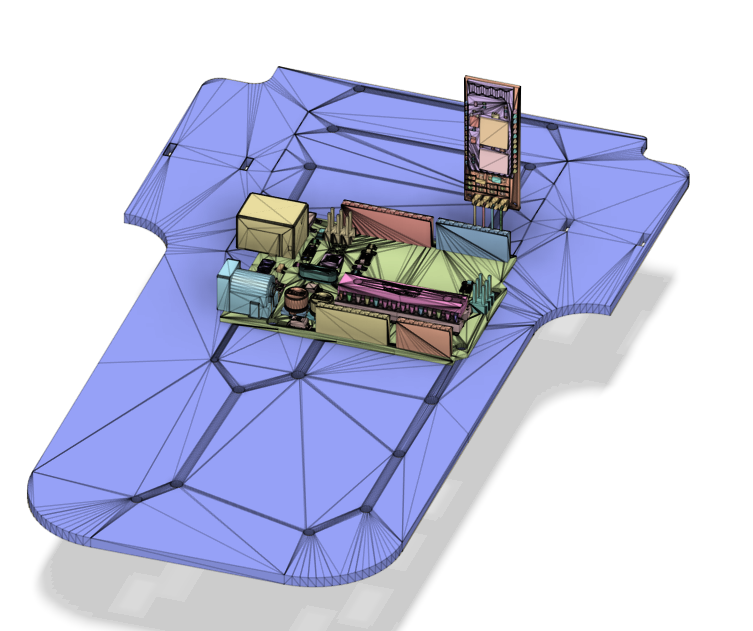
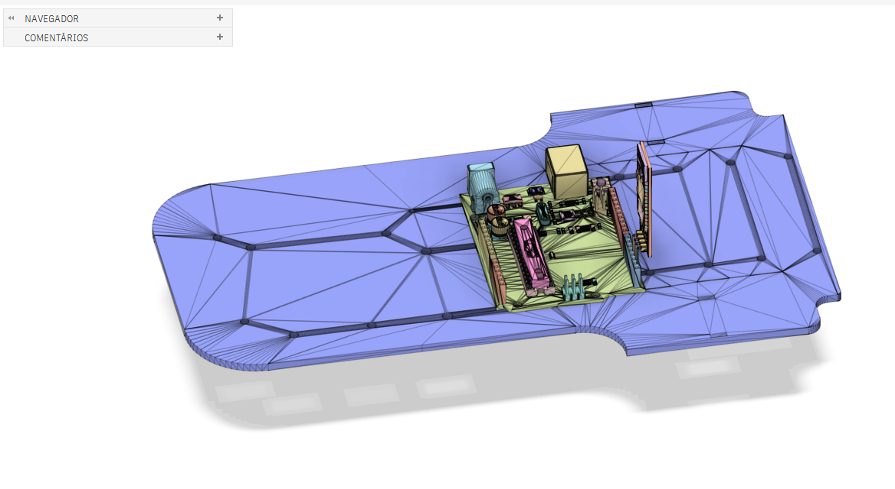
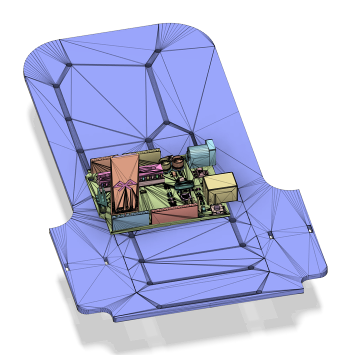
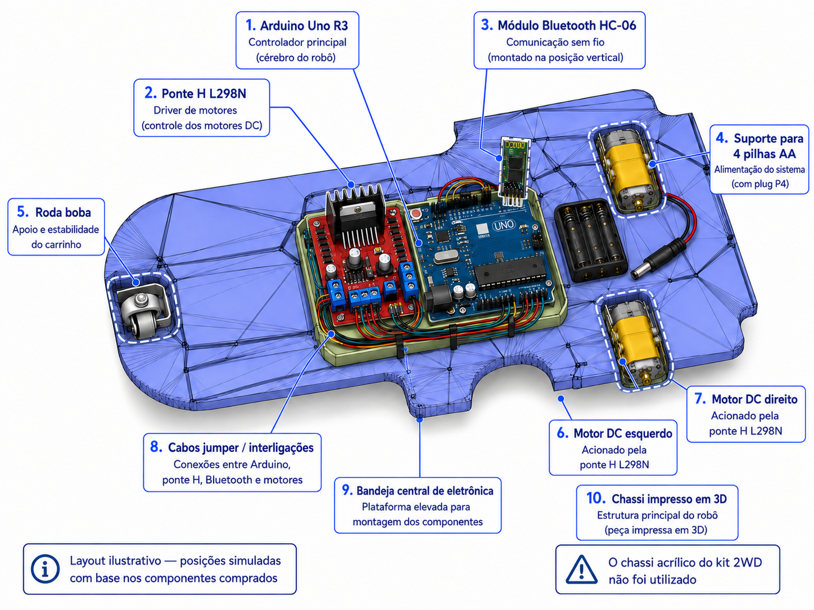
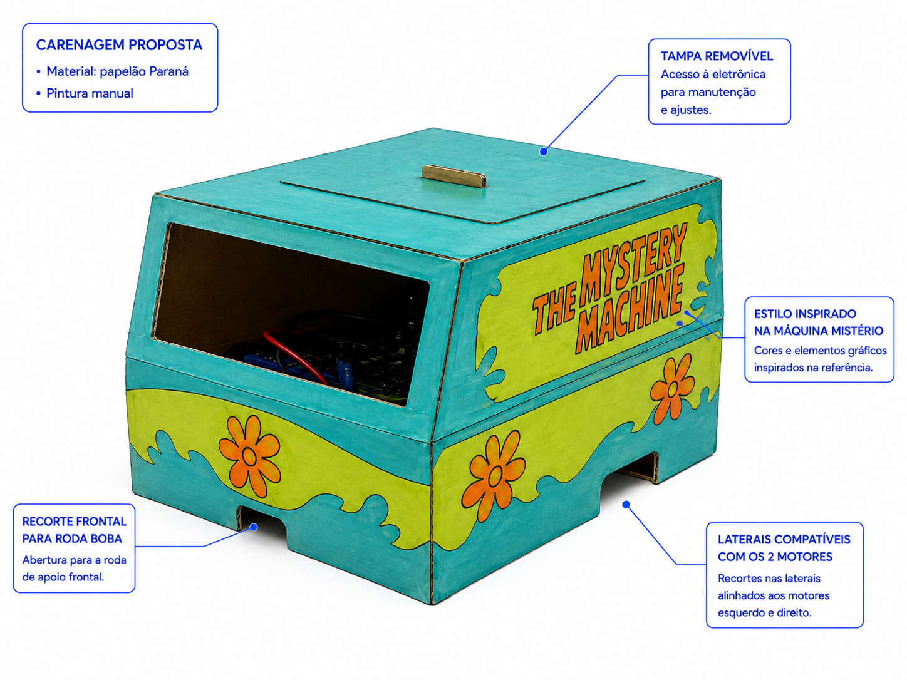

# Carrinho Controlado por Celular via Bluetooth

## Documentação Técnica

**Disciplina:** Project Maker Lab  
**Projeto:** Carrinho controlado pelo celular com Bluetooth e Arduino Uno  
**Integrantes:**
- Geovanna Silva Cunha RM97736
- Victor Camargo Maciel RM98384
  
**Turma:** 4ESPX

---

## 1. Introdução

Este projeto consiste no desenvolvimento de um carrinho robótico controlado por celular, utilizando comunicação **Bluetooth** e uma placa **Arduino Uno R3** como unidade de controle principal.

O carrinho foi montado com base em um **chassi impresso em 3D**. O sistema permite movimentação para frente, para trás e mudança de direção por meio do acionamento independente dos motores laterais.

Além da parte funcional, foi proposta uma **carenagem decorativa inspirada na Máquina Mistério (Scooby-Doo)**, produzida em **papelão Paraná** e pintura manual.

---

## 2. Objetivo do Projeto

Desenvolver um carrinho robótico com controle remoto via smartphone, integrando conceitos de:

- eletrônica;
- programação com Arduino;
- comunicação Bluetooth;
- prototipagem física;
- modelagem e organização de componentes;
- personalização estética do protótipo.

---

## 3. Lista de Componentes

| Quantidade | Componente | Observação |
|---|---|---|
| 1 | Placa compatível com Arduino Uno R3 (ATmega328 SMD) | Controlador principal |
| 1 | Módulo Bluetooth HC-06 | Comunicação com o celular |
| 1 | Ponte H dupla L298N | Controle dos motores |
| 1 | Suporte para 4 pilhas AA com plug P4 | Alimentação do sistema |
| 1 kit | Cabos jumper macho-macho / macho-fêmea | Interligações |
| 2 | Motores DC com encoder | Movimentação lateral |
| 1 | Roda boba | Apoio frontal |
| 1 | Chassi impresso em 3D | Estrutura principal |
| 1 | Carenagem em papelão Paraná | Cobertura e decoração |


---

## 4. Funcionamento do Sistema

O funcionamento do carrinho ocorre da seguinte forma:

1. O usuário envia um comando pelo aplicativo no celular.
2. O módulo **HC-06** recebe o comando via Bluetooth.
3. O **Arduino Uno R3** interpreta a informação recebida.
4. A **ponte H L298N** aciona os motores DC conforme o comando.
5. O carrinho executa o movimento desejado.

### Fluxo resumido

```text
Celular → Bluetooth HC-06 → Arduino Uno → Ponte H L298N → Motores DC → Movimento do carrinho
```

---

## 5. Ficha de Requisitos

### 5.1 Requisitos funcionais

| ID | Requisito |
|---|---|
| RF01 | O carrinho deve avançar. |
| RF02 | O carrinho deve recuar. |
| RF03 | O carrinho deve virar para a esquerda. |
| RF04 | O carrinho deve virar para a direita. |
| RF05 | O carrinho deve parar quando solicitado. |
| RF06 | O carrinho deve receber comandos via Bluetooth. |
| RF07 | O sistema deve ser controlado pelo celular. |

### 5.2 Requisitos não funcionais

| ID | Requisito |
|---|---|
| RNF01 | Os componentes devem estar fixados de forma segura no chassi. |
| RNF02 | Os cabos não devem interferir no movimento das rodas/motores. |
| RNF03 | A carenagem deve proteger os componentes sem impedir a manutenção. |
| RNF04 | A estrutura deve permitir visualização e organização dos componentes. |
| RNF05 | A decoração deve representar visualmente a Máquina Mistério. |

---

## 6. Estrutura do Carrinho

### 6.1 Chassi

O chassi do carrinho foi **impresso em 3D** e serve como base para a montagem de toda a eletrônica. Também foi impresso uma tampa para proteção dos componentes.

<p align="center">
  
</p>

<p align="center"><em>Figura 1 — Vista isométrica do chassi impresso em 3D.</em></p>

<p align="center">
  
</p>

<p align="center"><em>Figura 2 — Vista superior do chassi.</em></p>

<p align="center">
  
</p>

<p align="center"><em>Figura 3 — Vista posterior do chassi.</em></p>

### 6.2 Motores

O carrinho utiliza:

- **2 motores DC laterais**, responsáveis pela tração;
- **1 roda boba frontal**, responsável por apoio e estabilidade.

### 6.3 Alimentação

A alimentação é feita por um **suporte para 4 pilhas AA com plug P4**.

### 6.4 Organização dos componentes

A distribuição dos componentes foi planejada da seguinte maneira:

- **Arduino Uno R3:** região central;
- **Ponte H L298N:** próxima ao Arduino;
- **HC-06:** montado na parte superior da bandeja central;
- **Suporte de pilhas:** parte traseira/lateral do chassi;
- **Motores DC:** posicionados nas duas laterais mais largas do chassi;
- **Roda boba:** posicionada na extremidade frontal do carrinho.

### 6.5 Simulação da posição dos componentes

A figura abaixo apresenta uma simulação da disposição dos principais componentes sobre o chassi, considerando os itens adquiridos e a posição prevista para os dois motores e a roda boba.

<p align="center">
  
</p>

<p align="center"><em>Figura 4 — Simulação da posição dos componentes no chassi impresso em 3D.</em></p>

---

## 7. Medidas do Chassi

As medidas abaixo são estimadas com base no modelo 3D do projeto:

| Seção | Largura | Comprimento | Espessura |
|---|---:|---:|---:|
| Dianteira | ≈ 138 mm | ≈ 230 mm | ≈ 3 mm |
| Traseira | ≈ 130 mm | ≈ 212 mm | ≈ 7 mm |
| Bandeja central (eletrônica) | ≈ 69 mm | ≈ 53 mm | ≈ 1,7 mm |

### 7.1 Resumo geral

| Grandeza | Valor estimado |
|---|---|
| Comprimento total do chassi | ≈ 702 mm |
| Largura do chassi | ≈ 130–138 mm |
| Quantidade de motores | 2 |


---

## 8. Carenagem / Cobertura

Para isso, foi proposta uma cobertura simples, em formato retangular, feita em **papelão Paraná**, com pintura manual inspirada na **Máquina Mistério**.

### 8.1 Características da carenagem

- **Material:** papelão Paraná;
- **Acabamento:** pintura manual com tinta acrilica;
- **Formato:** caixa/cobertura retangular simples;
- **Referência visual:** Máquina Mistério do Scooby-Doo;

### 8.2 Função da carenagem

A carenagem tem como objetivo melhorar o acabamento visual do carrinho.

### 8.3 Simulação da carenagem proposta

<p align="center">
  
</p>

<p align="center"><em>Figura 5 — Simulação da carenagem proposta em papelão Paraná, inspirada na Máquina Mistério.</em></p>

---

## 9. Processo de Montagem da Carenagem

A carenagem pode ser construída com as seguintes etapas:

1. Medir o volume externo do chassi e da eletrônica.
2. Cortar os painéis do papelão Paraná.
3. Montar a estrutura principal em formato retangular.
4. Fazer os recortes frontais e laterais.
5. Pintar a estrutura com as cores da Máquina Mistério.
6. Adicionar detalhes decorativos, como flores e a escrita lateral.
7. Fixar a carenagem ao chassi com fita dupla face, encaixes ou outro método leve.

---

## 10. Considerações Finais

O projeto do carrinho controlado por celular permitiu integrar hardware, software e prototipagem em uma solução funcional e personalizada.

Além da parte eletrônica e mecânica, a proposta da carenagem agregou valor visual ao projeto, tornando o protótipo mais completo e alinhado com a identidade temática escolhida pelo grupo.


