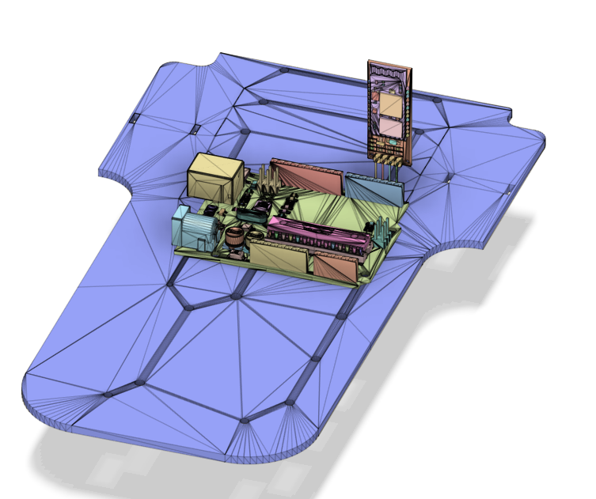
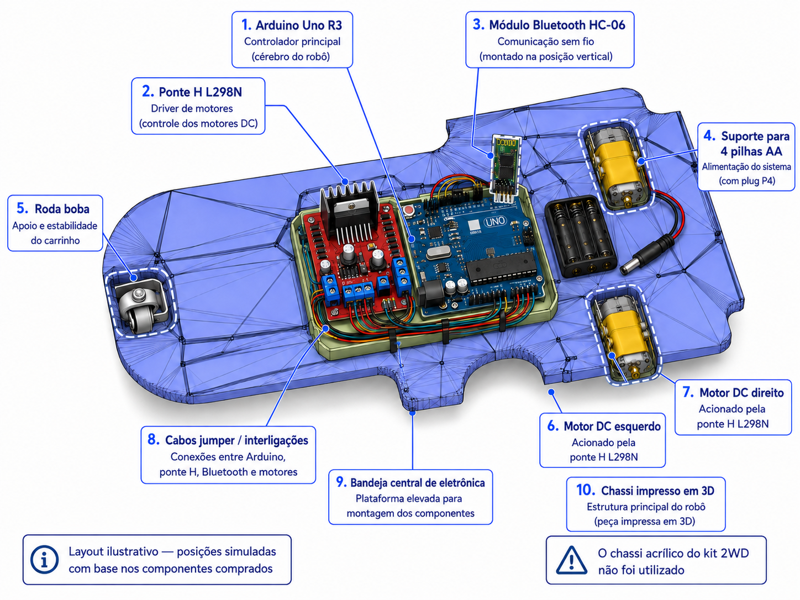
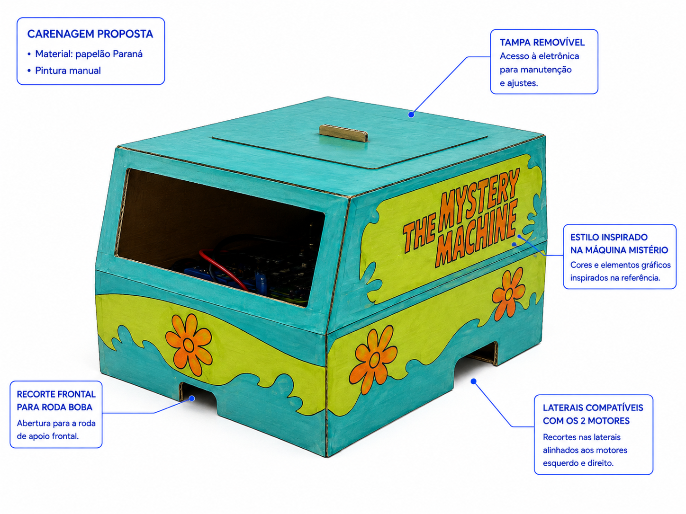

# Carrinho Controlado por Celular via Bluetooth

## Documentação Técnica

**Disciplina:** Project Maker Lab  
**CP01:** Carrinho controlado pelo celular com Bluetooth e Arduino Uno  
**GS:** Carrinho com TinyML para monitoramento de microclima de horta comunitária (tema CitizenTech) — ver seção 14  
**Vídeo da GS:** [VIDEO DO YOUTUBE](https://youtu.be/oJFVsnZvias)  
**Integrantes:**
- Geovanna Silva Cunha — RM97736
- Victor Camargo Maciel — RM98384
- Pedro Emerici Gava — RM551043
- Bianca Carvalho Dancs — RM 551645

**Turma:** 4ESPX

---

## 1. Introdução

Este projeto consiste no desenvolvimento de um carrinho robótico controlado por celular, utilizando comunicação **Bluetooth** e uma placa **Arduino Uno R3** como unidade de controle principal.

O carrinho foi montado com base em um **chassi impresso em 3D**. O sistema permite movimentação para frente, para trás e mudança de direção por meio do acionamento independente dos motores laterais.

Além da parte funcional, foi proposta uma **carenagem decorativa inspirada na Máquina Mistério (Scooby-Doo)**, produzida em **papelão Paraná** e com pintura manual.

---

## 2. Objetivo do Projeto

Desenvolver um carrinho robótico com controle remoto via smartphone, integrando conceitos de:

- eletrônica;
- programação com Arduino;
- comunicação Bluetooth;
- prototipagem física;
- modelagem e organização de componentes;
- personalização estética do protótipo.

---

## 3. Lista de Componentes

| Quantidade | Componente | Observação |
|---|---|---|
| 1 | Placa compatível com Arduino Uno R3 (ATmega328 SMD) | Controlador principal |
| 1 | Módulo Bluetooth HC-06 | Comunicação com o celular |
| 1 | Ponte H dupla L298N | Controle dos motores |
| 2 | Suporte para 4 pilhas AA com plug P4 | Alimentação do sistema |
| 1 kit | Cabos jumper macho-macho / macho-fêmea | Interligações |
| 2 | Motores DC com encoder | Movimentação lateral |
| 1 | Roda boba | Apoio frontal |
| 1 | Chassi impresso em 3D | Estrutura principal |
| 1 | Carenagem em papelão Paraná | Cobertura e decoração |
| 1 | Sensor ultrassônico HC-SR04 | Detecção de obstáculos à frente do carrinho |

> Os motores adquiridos possuem encoder, porém o código fornecido realiza apenas o acionamento dos motores pela ponte H; não há leitura dos encoders implementada.

---

## 4. Funcionamento do Sistema

O funcionamento do carrinho ocorre da seguinte forma:

1. O usuário envia um comando pelo aplicativo no celular.
2. O módulo **HC-06** recebe o comando via Bluetooth.
3. O **Arduino Uno R3** interpreta o caractere recebido pela comunicação serial.
4. A **ponte H L298N** aciona os motores DC conforme o comando.
5. O carrinho executa o movimento desejado.
6. Se o caminho estiver livre, a ponte H L298N aciona os motores DC conforme o comando, com controle de velocidade via PWM (ENA/ENB).
7.  O carrinho executa o movimento desejado.

### 4.1 Fluxo resumido

```text
Celular → Bluetooth HC-06 → Arduino Uno → [verificação do sensor HC-SR04] → Ponte H L298N → Motores DC → Movimento do carrinho
```

### 4.2 Comandos utilizados

O Arduino interpreta os seguintes caracteres:

| Comando | Ação |
|---|---|
| `F` | Avançar |
| `B` | Recuar |
| `R` | Virar para a direita |
| `L` | Virar para a esquerda |
| Outro caractere | Parar |

A comunicação serial é inicializada em **9600 bps**.

### 4.3 Pinos utilizados no Arduino

| Pino Arduino | Definição no código | Função |
|---:|---|---|
| 3 | `IN1` | Controle do motor esquerdo |
| 4 | `IN2` | Controle do motor esquerdo |
| 5 | `IN3` | Controle do motor direito |
| 6 | `IN4` | Controle do motor direito |
| 9 | `ENA (PWM)`|   Controle do motor direito |
| 10 | `ENB (PWM)`|  Controle do motor direito |
| 11 | `SENSOR_VCC`|  Controle do motor direito |
| 12 | `TRIG`|  Controle do motor direito |
| 13 | `ECHO`|  Controle do motor direito |
| GND| `---`|  Controle do motor direito |

---

## 5. Ficha de Requisitos

### 5.1 Requisitos funcionais

| ID | Requisito |
|---|---|
| RF01 | O carrinho deve avançar. |
| RF02 | O carrinho deve recuar. |
| RF03 | O carrinho deve virar para a esquerda. |
| RF04 | O carrinho deve virar para a direita. |
| RF05 | O carrinho deve parar quando solicitado. |
| RF06 | O carrinho deve receber comandos via Bluetooth. |
| RF07 | O sistema deve ser controlado pelo celular. |

### 5.2 Requisitos não funcionais

| ID | Requisito |
|---|---|
| RNF01 | Os componentes devem estar fixados de forma segura no chassi. |
| RNF02 | Os cabos não devem interferir no movimento dos motores ou da roda boba. |
| RNF03 | A carenagem deve proteger os componentes sem impedir a manutenção. |
| RNF04 | A estrutura deve permitir organização dos componentes. |
| RNF05 | A decoração deve representar visualmente a Máquina Mistério. |

---

## 6. Estrutura do Carrinho

### 6.1 Chassi

O chassi do carrinho foi **impresso em 3D** e serve como base para a montagem de toda a eletrônica. Também foi impressa uma tampa para a proteção dos componentes.

<p align="center">
  
</p>

<p align="center"><em>Figura 1 — Vista isométrica do chassi impresso em 3D.</em></p>

### 6.2 Motores e roda de apoio

O carrinho utiliza:

- **2 motores DC laterais**, responsáveis pela tração;
- **1 roda boba frontal**, responsável pelo apoio e estabilidade.

O controle de direção é realizado alterando o sentido de rotação dos dois motores por meio da ponte H L298N.

### 6.3 Alimentação

A alimentação é feita por um **suporte para 4 pilhas AA com plug P4**.

### 6.4 Organização dos componentes

A distribuição dos componentes foi planejada da seguinte maneira:

- **Arduino Uno R3:** região central;
- **Ponte H L298N:** próxima ao Arduino;
- **HC-06:** montado na parte superior da bandeja central;
- **Suporte de pilhas:** região traseira/lateral do chassi;
- **Motores DC:** posicionados nas duas laterais mais largas do chassi;
- **Roda boba:** posicionada na extremidade frontal do carrinho.

### 6.5 Simulação da posição dos componentes

A figura abaixo apresenta uma simulação da disposição dos principais componentes sobre o chassi, considerando os itens adquiridos e a posição prevista para os dois motores e a roda boba.

<p align="center">
  
</p>

<p align="center"><em>Figura 4 — Simulação da posição dos componentes no chassi impresso em 3D.</em></p>

---

## 7. Medidas do Chassi

As medidas abaixo são estimadas com base no modelo 3D do projeto:

| Seção | Largura | Comprimento | Espessura |
|---|---:|---:|---:|
| Dianteira | ≈ 138 mm | ≈ 230 mm | ≈ 3 mm |
| Traseira | ≈ 130 mm | ≈ 212 mm | ≈ 7 mm |
| Bandeja central (eletrônica) | ≈ 69 mm | ≈ 53 mm | ≈ 1,7 mm |

### 7.1 Resumo geral

| Grandeza | Valor estimado |
|---|---|
| Comprimento total do chassi | ≈ 702 mm |
| Largura do chassi | ≈ 130–138 mm |
| Quantidade de motores | 2 |

### 7.2 Medida dos componentes

| Componente | Comprimento | Largura | Altura | Forma de fixação |
|---|---|---|---|---|
| Motor esquerdo | 64,25mm | 19,4mm | 22,6mm | Parafuso com estrutura impressa em 3D |
| Motor direito | 64,25mm | 19,4mm | 22,6mm | Parafuso com estrutura impressa em 3D |
| Arduino | 66,5mm | 54,1mm | 12,55mm | Amarração com cabo |
| Ponte H | 44,2mm | 43,6mm | 11,2mm | Amarração com cabo |
| Bateria | 70,5mm | 12,7mm | 11,3mm | Cola instantânea |
| Sensor | 40,5mm | 20,4mm | 11,6mm | Cola instantânea |


---

## 8. Carenagem / Cobertura

Foi proposta uma cobertura simples, em formato retangular, feita em **papelão Paraná**, com pintura manual inspirada na **Máquina Mistério**, do Scooby-Doo.

### 8.1 Características da carenagem

- **Material:** papelão Paraná;
- **Acabamento:** pintura manual com tinta acrilica;
- **Formato:** caixa/cobertura retangular simples;
- **Referência visual:** Máquina Mistério do Scooby-Doo;
- **Compatibilidade:** a estrutura deverá deixar livres as regiões dos dois motores e da roda boba.

### 8.2 Função da carenagem

A carenagem tem como objetivo:

- melhorar o acabamento visual do carrinho;
- criar uma identidade temática para o protótipo;

### 8.3 Simulação da carenagem proposta

<p align="center">
  
</p>

<p align="center"><em>Figura 5 — Simulação da carenagem proposta em papelão Paraná, inspirada na Máquina Mistério.</em></p>

---

## 9. Processo de Montagem da Carenagem

A carenagem pode ser construída com as seguintes etapas:

1. Medir o espaço necessário para cobrir o chassi e os componentes eletrônicos.
2. Cortar os painéis do papelão Paraná.
3. Montar a estrutura principal em formato retangular.
4. Fazer os recortes necessários para não interferir nos motores e na roda boba.
5. Pintar a estrutura com as cores inspiradas na Máquina Mistério.
6. Adicionar detalhes decorativos, como flores e a escrita lateral.
7. Fixar a carenagem ao chassi utilizando um método leve e removível.

---

## 10. Código do Projeto

O código do Arduino está disponível em [`src/codigo.ino`](./src/codigo.ino).

O programa lê um caractere recebido pela porta serial e executa a função de movimento correspondente.

```cpp
// ===================== PINOS - MOTORES =====================
#define IN1 3 // Roda esquerda 1
#define IN2 4 // Roda esquerda 2
#define IN3 5 // Roda direita 1
#define IN4 6 // Roda direita 2
#define ENA 9  // PWM - velocidade motor esquerdo
#define ENB 10 // PWM - velocidade motor direito

// ===================== PINOS - SENSOR ULTRASSÔNICO (HC-SR04) =====================
// GND do sensor -> pino GND físico da placa
// VCC do sensor -> pino digital 11, mantido sempre em HIGH (simula 5V)
#define SENSOR_VCC 11
#define TRIG 12
#define ECHO 13

// ===================== VARIÁVEIS =====================
char comando;
int velocidade = 200;       // valor padrão (0 a 255)
long distancia;              // distância medida em cm
const int DISTANCIA_MINIMA = 15; // cm - abaixo disso, para o carrinho

// ===================== FUNÇÕES - MOTORES =====================
void parar()
{
  digitalWrite(IN1, LOW);
  digitalWrite(IN2, LOW);
  digitalWrite(IN3, LOW);
  digitalWrite(IN4, LOW);
  analogWrite(ENA, 0);
  analogWrite(ENB, 0);
}

void andar_frente()
{
  digitalWrite(IN1, HIGH);
  digitalWrite(IN2, LOW);
  digitalWrite(IN3, HIGH);
  digitalWrite(IN4, LOW);
  analogWrite(ENA, velocidade);
  analogWrite(ENB, velocidade);
}

void andar_tras()
{
  digitalWrite(IN1, LOW);
  digitalWrite(IN2, HIGH);
  digitalWrite(IN3, LOW);
  digitalWrite(IN4, HIGH);
  analogWrite(ENA, velocidade);
  analogWrite(ENB, velocidade);
}

void andar_direita()
{
  digitalWrite(IN1, HIGH);
  digitalWrite(IN2, LOW);
  digitalWrite(IN3, LOW);
  digitalWrite(IN4, HIGH);
  analogWrite(ENA, velocidade);
  analogWrite(ENB, velocidade);
}

void andar_esquerda()
{
  digitalWrite(IN1, LOW);
  digitalWrite(IN2, HIGH);
  digitalWrite(IN3, HIGH);
  digitalWrite(IN4, LOW);
  analogWrite(ENA, velocidade);
  analogWrite(ENB, velocidade);
}

// ===================== FUNÇÃO - SENSOR ULTRASSÔNICO =====================
long medir_distancia()
{
  digitalWrite(TRIG, LOW);
  delayMicroseconds(2);
  digitalWrite(TRIG, HIGH);
  delayMicroseconds(10);
  digitalWrite(TRIG, LOW);

  long duracao = pulseIn(ECHO, HIGH, 30000); // timeout de 30ms evita travar se não houver eco
  if (duracao == 0) return 999; // não detectou nada = "livre"

  long dist = duracao * 0.034 / 2; // converte tempo em cm
  return dist;
}

// ===================== SETUP =====================
void setup()
{
  Serial.begin(9600);

  pinMode(IN1, OUTPUT);
  pinMode(IN2, OUTPUT);
  pinMode(IN3, OUTPUT);
  pinMode(IN4, OUTPUT);
  pinMode(ENA, OUTPUT);
  pinMode(ENB, OUTPUT);

  pinMode(SENSOR_VCC, OUTPUT);
  digitalWrite(SENSOR_VCC, HIGH); // alimenta o sensor via pino digital

  pinMode(TRIG, OUTPUT);
  pinMode(ECHO, INPUT);
  pinMode(11, OUTPUT);
  digitalWrite(11, HIGH);

  parar(); // garante que o carrinho começa parado
}

// ===================== LOOP =====================
void loop()
{
  distancia = medir_distancia();

  if (Serial.available() > 0)
  {
    String entrada = Serial.readStringUntil('\n');
    entrada.trim();

    if (entrada.length() == 0) return;

    comando = entrada.charAt(0);

    // Se vier um número junto (ex: "F150"), atualiza a velocidade
    if (entrada.length() > 1)
    {
      int novaVelocidade = entrada.substring(1).toInt();
      if (novaVelocidade >= 0 && novaVelocidade <= 255)
      {
        velocidade = novaVelocidade;
      }
    }

    switch (comando)
    {
      case 'F': // frente
        if (distancia > DISTANCIA_MINIMA)
        {
          andar_frente();
        }
        else
        {
          parar();
          Serial.println("Obstáculo detectado! Frente bloqueada.");
        }
        break;
      case 'B': // trás - não bloqueado pelo sensor (ele olha só para frente)
        andar_tras();
        break;
      case 'R': // direita
        andar_direita();
        break;
      case 'L': // esquerda
        andar_esquerda();
        break;
      case 'S': // stop
        parar();
        break;
      default:
        parar();
        break;
    }
  }

  // Segurança extra: se estiver andando para frente e um obstáculo aparecer no meio do caminho, para
  if (distancia <= DISTANCIA_MINIMA && comando == 'F')
  {
    parar();
  }
}

```

---

## 11. Considerações Finais

O projeto do carrinho controlado por celular permitiu integrar hardware, software e prototipagem em uma solução funcional e personalizada.

A comunicação Bluetooth permite o envio de comandos pelo smartphone, enquanto o Arduino interpreta esses comandos e controla os dois motores por meio da ponte H L298N.

Além da parte eletrônica e mecânica, a proposta da carenagem agrega valor visual ao projeto, tornando o protótipo mais completo e alinhado com a identidade temática escolhida pelo grupo.

---

## 12. Estrutura do Repositório

```text
CP01-maker_lab/
│
├── README.md
├── Precificação.xlsx
├── links.txt
│
├── images/                          → fotos e desenhos do chassi e da carenagem
│
├── src/
│   └── tinyml_inferencia.ino        → código final (sensor + modelo + motores + BLE)
│
├── model/
│   └── model.h                      → modelo exportado do Edge Impulse
│
├── docs/
│   └── dataset.csv                  → dataset usado no treinamento
│
└── tools/
    ├── coleta_dataset/
    │   └── coleta_dataset.ino       → sketch de coleta do dataset
    └── salvar_dataset.py            → script que grava a coleta direto em CSV
```

---

## 13. Etapa 2 — TinyML no ESP32-S3

### Sobre o projeto

Evolução do carrinho controlado por celular da etapa anterior. O Arduino Uno foi substituído por um **ESP32-S3**, que roda um **modelo de Machine Learning embarcado (TinyML)** treinado no **Edge Impulse**.

O sensor ultrassônico HC-SR04 mede a distância à frente do carrinho e o modelo classifica cada leitura em:

| Classe | Significado |
|---|---|
| `0` | Caminho livre |
| `1` | Obstáculo |

Quando o carrinho está andando para frente e o modelo detecta um obstáculo (probabilidade acima de 60%), ele para, gira (alternando entre direita e esquerda) e volta a andar. O controle manual é feito pelo celular via **BLE**.

---

### Componentes

- ESP32-S3-DevKitC-1
- Sensor ultrassônico HC-SR04
- Ponte H L298N
- 2 motores DC com rodas
- Resistores de 1 kΩ e 2 kΩ (divisor de tensão do ECHO)
- Mini protoboard e jumpers
- Suporte de pilhas AA
- Chassi impresso em 3D

---

### Ligações

| Componente | Pino | ESP32-S3 / destino |
|---|---|---|
| HC-SR04 | VCC | 5V da ponte H |
| HC-SR04 | GND | GND comum |
| HC-SR04 | TRIG | GPIO 12 |
| HC-SR04 | ECHO | GPIO 13 (via divisor 1 kΩ / 2 kΩ) |
| L298N | IN1 / IN2 | GPIO 4 / GPIO 5 |
| L298N | IN3 / IN4 | GPIO 6 / GPIO 7 |
| L298N | ENA / ENB | GPIO 15 / GPIO 16 (PWM) |
| L298N | 12V / GND | Pilhas (+) / (−) |

O ECHO do HC-SR04 sai em 5V e o ESP32-S3 trabalha com 3,3V, por isso o sinal passa por um divisor de tensão: `ECHO → 1 kΩ → GPIO 13 → 2 kΩ → GND`.

Todos os GNDs (ESP32, ponte H, sensor e pilhas) são ligados em comum.

---

### Pipeline de TinyML

#### 1. Coleta
O `coleta_dataset.ino` mede a distância a cada 100 ms e envia pela serial no formato `valor,label`. O `salvar_dataset.py` recebe esses dados e grava o CSV. A classe é escolhida durante a coleta enviando `0` (livre) ou `1` (obstáculo).

#### 2. Pré-processamento
Aplicado igualmente na coleta e na inferência:
1. Limite da distância entre 2 e 100 cm (sem eco = 100 cm)
2. Média móvel das últimas 5 leituras
3. Normalização para a faixa 0–1

#### 3. Limpeza do dataset
Foram removidas as amostras de transição gravadas enquanto o objeto mudava de posição:
- Obstáculo: mantidas apenas leituras até **25 cm**
- Livre: mantidas apenas leituras a partir de **30 cm**
- A faixa de 25 a 30 cm ficou fora, como margem entre as classes

Resultado: 1.128 → **856 amostras** (513 livre / 343 obstáculo).

#### 4. Treinamento (Edge Impulse)
- Entrada: 1 feature (`valor`)
- Blocos: Raw Data + Classification
- Rede: Dense (20) → Dense (10) → saída (2 classes)
- 200 ciclos de treino, learning rate 0,005
- Modelo quantizado em int8

#### 5. Resultados
| Conjunto | Acurácia |
|---|---|
| Validação | 100% (loss 0,00) |
| Teste | _preencher com o resultado de Model testing_ |

---

### Como refazer a coleta de dados

1. Grave `tools/coleta_dataset/coleta_dataset.ino` no ESP32-S3 e feche o Serial Monitor do Arduino IDE.
2. Instale a dependência do script: `pip install pyserial`.
3. Ajuste a porta na linha `PORTA = "COM9"` do `salvar_dataset.py` e rode `python salvar_dataset.py`.
4. Digite `1` com um objeto a até 20 cm do sensor (obstáculo), `p` para pausar, `0` com o caminho livre ou objetos a mais de 30 cm (livre), e `sair` para salvar.
5. O arquivo `dataset.csv` é gerado na mesma pasta do script, já sem as mensagens de controle.

---

### Como executar

1. Instale a biblioteca do modelo no Arduino IDE: **Sketch → Include Library → Add .ZIP Library** (arquivo exportado em Deployment → Arduino library no Edge Impulse).
2. Selecione a placa **ESP32S3 Dev Module**.
3. Abra `src/tinyml_inferencia.ino` e faça o upload. Se aparecer "Sketch too big", use **Tools → Partition Scheme → Huge APP**.
4. Ligue as pilhas na ponte H.

---

### Controle pelo celular (BLE)

O carrinho aparece como **Carrinho-ESP32**. A conexão é feita pelo app (não pelas configurações de Bluetooth do celular).

| Comando | Ação |
|---|---|
| `F` | Frente |
| `B` | Ré |
| `L` | Esquerda |
| `R` | Direita |
| `S` | Parar |
| `F255` | Frente com velocidade definida (0–255) |

Apps testados: **Serial Bluetooth Terminal** (Android, aba Bluetooth LE) e **Bluefruit Connect** (Controller → Control Pad). Se o celular desconectar, o carrinho para automaticamente.

---

### Aprendizados

- O ESP32-S3 não tem Bluetooth clássico, então a comunicação foi migrada para BLE (Nordic UART Service).
- O pino de ECHO precisa de divisor de tensão para não danificar o ESP32.
- Pela porta USB, o 5V do ESP32 não foi suficiente para o HC-SR04; o sensor passou a ser alimentado pelo regulador de 5V da ponte H.
- Os motores precisam de alimentação própria (pilhas); a energia do USB não é suficiente para girá-los.
- Sem jumper ou sinal em ENA/ENB, a ponte H mantém os motores desligados.
- Dados mal rotulados derrubam o modelo: a limpeza do dataset foi essencial para separar bem as classes.

---

## 14. GS — CitizenTech: Monitoramento de Microclima da Horta

### 14.1 Visão geral

Evolução do carrinho para a GS de Project-based Maker Lab, no tema **CitizenTech** (horta comunitária). O carrinho percorre a horta, para junto de cada canteiro, mede a temperatura e a umidade do ar na altura das plantas e usa um modelo **TinyML** para classificar o risco de estresse térmico e hídrico, enviando o relatório ao celular por BLE.

A GS pedia pelo menos um sensor adicional e uma integração melhor com IA. Ambos foram atendidos:

- **Sensor adicional:** DHT11 (temperatura e umidade do ar);
- **IA:** modelo TinyML treinado no Edge Impulse, rodando no ESP32-S3.

**Vídeo de demonstração (YouTube):** [COLE AQUI O LINK DO VÍDEO NO YOUTUBE]

### 14.2 Problema e proposta

Em hortas comunitárias, nem sempre há equipamento para saber se o ar está seco, quente ou úmido demais, o que causa estresse nas plantas e doenças por fungos. A proposta é um carrinho que faz essa leitura junto de cada canteiro e traduz os números em uma classificação de risco com uma sugestão de ação.

O sensor DHT11 fica na parte de baixo do carrinho, o mais perto possível do solo. O sistema mede apenas o ar e **indica risco**; ele não faz irrigação automática nem substitui um sensor de umidade do solo.

### 14.3 Ferramentas e componentes acrescentados

**Hardware**

- Sensor DHT11, módulo de 3 pinos (temperatura e umidade do ar)

**Software e plataformas**

- Edge Impulse Studio (treinamento, teste e exportação do modelo)
- Arduino IDE, com a biblioteca do modelo exportada do Edge Impulse (`ei-microclima-arduino-1.0.1-impulse-#1`)
- Bibliotecas Arduino: **DHT sensor library** e **Adafruit Unified Sensor** (Adafruit)
- Python, com `pyserial`, `pandas` e `numpy`, para os scripts de coleta e de preparação do dataset
- Apps BLE: Serial Bluetooth Terminal e Bluefruit Connect

### 14.4 Ligação do DHT11

- **VCC:** 3V3 do ESP32-S3 (não usar 5V, pois o pino de dados sairia em 5V)
- **GND:** GND comum
- **DATA (S):** GPIO 8

As demais ligações continuam as da seção 13. Se for usado um DHT11 de 4 pinos (sem placa), é necessário um resistor de 10 kΩ entre DATA e 3V3.

### 14.5 VPD e classes de risco

Temperatura e umidade relativa isoladas dizem pouco: 30 °C com 80% de umidade é bem diferente de 30 °C com 30%. Por isso usamos o **VPD (déficit de pressão de vapor)**, que combina as duas leituras em um único valor e representa o quanto o ar "puxa" água das plantas:

```text
es  = 0,6108 × exp(17,27 × T / (T + 237,3))     (kPa, T em °C)
VPD = es × (1 − UR / 100)                        (kPa)
```

Classes de saída:

- **ideal:** VPD de 0,4 a 1,2 kPa
- **umido:** VPD abaixo de 0,4 kPa (ar quase saturado, risco de fungos e doenças foliares)
- **atencao:** VPD de 1,2 a 2,0 kPa (ar seco ou quente; irrigação preventiva ou sombreamento)
- **critico:** VPD a partir de 2,0 kPa, ou temperatura a partir de 35 °C, independente do VPD

As faixas seguem a literatura de cultivo protegido, que costuma apontar de 0,4 a 1,2 kPa como faixa ideal para hortaliças. Os limiares são parâmetros no código e devem ser ajustados por cultura.

Fonte das faixas: _[inserir a referência bibliográfica escolhida]_

### 14.6 Pipeline de TinyML do microclima

#### 1. Pré-processamento
Aplicado igualmente na coleta e na inferência:
1. Mediana móvel das últimas 5 leituras do DHT11 (uma leitura a cada 2 s)
2. Normalização: temperatura ÷ 50 e umidade ÷ 100, ambas na faixa 0–1

O modelo recebe apenas `temp_n` e `ur_n`, sem o VPD pronto, e precisa aprender a relação não linear entre as duas variáveis.

#### 2. Divisão treino e teste
A divisão foi feita **por sessão**, e não por linhas sorteadas, porque leituras vizinhas são quase idênticas e um sorteio linha a linha inflaria a acurácia.

- Treino: 14 sessões, 1.174 amostras (ideal 395, crítico 277, atenção 258, úmido 244)
- Teste: 6 sessões, 475 amostras (ideal 106, úmido 112, crítico 190, atenção 67)

#### 3. Treinamento (Edge Impulse)
- Entrada: 2 eixos (`temp_n` e `ur_n`), com janela de 2000 ms (1 leitura por janela)
- Blocos: Flatten + Classification
- Rede: Dense (16) → Dense (16) → saída (4 classes)
- Modelo quantizado em int8, compilado com o EON Compiler

#### 4. Resultados

- **Validação (int8):** acurácia de 97,9% e loss de 0,05
- **Teste (float32, sessões nunca vistas):** acurácia de 95,58%
- **Teste (int8):** _preencher com o resultado de Model testing na versão Quantized (int8)_

Desempenho por classe no conjunto de teste:

- **umido:** 100% de acerto
- **atencao:** 98,5% de acerto (1,5% classificado como incerto)
- **critico:** 94,7% de acerto (5,3% classificado como atenção)
- **ideal:** 90,6% de acerto (9,4% classificado como incerto)

Os erros se concentram nas fronteiras entre classes vizinhas, que correspondem aos limiares de VPD (1,2 e 2,0 kPa) e de 35 °C. Nenhuma amostra crítica foi classificada como ideal ou úmida.

Desempenho no ESP32-S3: **1 ms** de inferência, **1,4 KB** de RAM de pico e **14,6 KB** de flash.

#### 5. Comparação com a regra do VPD
Como o rótulo vem da própria regra, a regra tem 100% de acerto por definição e serve de referência. O modelo chegou a 95,58% no teste. A vantagem do TinyML é executar a classificação no ESP32 sem depender da fórmula nem de rede, com um modelo de poucos kilobytes.

#### 6. Modo degradado
Se o modelo falhar ou a confiança ficar abaixo de 0,6, o carrinho usa a regra do VPD (`classificarRegra`) como reserva e registra isso no log. O relatório informa se quem decidiu foi o TinyML ou a regra.

### 14.7 Funcionamento no carrinho

- **Modo patrulha (`P`):** o carrinho anda e, ao encontrar um obstáculo (um canteiro ou vaso), para, mede o microclima, envia o relatório ao celular e depois desvia normalmente, seguindo para o próximo. Cada medição espera 5 leituras novas do DHT11 e há um intervalo mínimo de 15 s entre medições.
- **Medição imediata (`M`):** mede o microclima na hora, com o carrinho parado.
- **Relatório BLE:** o celular recebe o canteiro, a temperatura, a umidade, o VPD, a classe e uma sugestão de ação (por exemplo, "Ar seco/quente: irrigar ou sombrear").
- **Desvio de obstáculo:** o HC-SR04 passou a usar um **limiar fixo** (média móvel das últimas 5 leituras abaixo de 27 cm), em vez do modelo da etapa 2.

O Edge Impulse não permite duas bibliotecas de modelo no mesmo sketch (as duas trazem cópias do SDK com as mesmas funções e macros). Por isso, na versão da GS a IA ficou concentrada no microclima. O sketch da etapa 2, com o modelo do ultrassônico, permanece no histórico do repositório.

Comandos adicionais (os da seção 13 continuam valendo):

- `P`: liga ou desliga a patrulha
- `M`: mede o microclima agora

Qualquer comando manual (`F`, `B`, `L`, `R`, `S` ou o Control Pad) desliga a patrulha.

### 14.8 Comportamento em falhas

- **DHT11 sem resposta:** após 5 falhas seguidas o carrinho avisa no Serial e no celular; ao medir, informa "sem leitura" e não classifica com dado inválido. A patrulha continua.
- **Leitura isolada inválida (`NaN`):** é ignorada.
- **Celular desconectado:** o carrinho para e a patrulha é desligada.
- **Modelo incerto ou com falha:** a regra do VPD assume a classificação.

### 14.9 Como executar a versão da GS

1. Instale **DHT sensor library** e **Adafruit Unified Sensor** pelo Gerenciador de Bibliotecas.
2. Instale a biblioteca do modelo: **Sketch → Include Library → Add .ZIP Library** (arquivo `ei-microclima-arduino-1.0.1-impulse-#1`). Confira em `Documentos/Arduino/libraries/<pasta>/src/` o nome do arquivo `*_inferencing.h` e ajuste o `#include` da primeira linha do sketch, se necessário. Mantenha **apenas uma** biblioteca do Edge Impulse instalada para este sketch.
3. Selecione a placa **ESP32S3 Dev Module**, abra `src/tinyml_inferencia.ino` e faça o upload.
4. Abra o Serial Monitor em 115200. Ao iniciar, deve aparecer `Modelo de microclima: 2 entradas, 4 classes`.
5. Conecte ao BLE `Carrinho-ESP32` e envie `M` para medir ou `P` para iniciar a patrulha.

**Ajuste de polaridade dos motores:** as constantes `INVERTER_MOTOR_A` e `INVERTER_MOTOR_B`, no topo do sketch, invertem o sentido de cada motor por código. Com os motores ligados como no nosso carrinho, ambas ficam em `true`. Se algum motor girar ao contrário, troque a constante correspondente.

### 14.10 Como fazer o dataset

**Dataset sintético (usar no treinamento)**

1. Rode `python gerar_dataset_sintetico.py`, que gera `dataset_microclima.csv` no mesmo formato da coleta real.
2. Rode `python preparar_edge_impulse.py`, que separa as sessões em treino e teste e gera as pastas `ei_treino/` e `ei_teste/` com um CSV por trecho (`<classe>.s<sessão>_<trecho>.csv`, com colunas `timestamp`, `temp_n` e `ur_n`).
3. No Edge Impulse Studio, em **Data acquisition → Upload data**, envie `ei_treino/` como *Training* e `ei_teste/` como *Testing*, inferindo o rótulo pelo nome do arquivo.
4. Crie o impulse (janela de 2000 ms, Flatten, Classification), treine, rode **Model testing → Classify all** e exporte em **Deployment → Arduino library** (Quantized int8).

**Coleta real (opcional)**

1. Grave `tools/coleta_microclima/coleta_microclima.ino` no ESP32-S3 e feche o Serial Monitor.
2. Ajuste a porta na linha `PORTA = "COM9"` do `salvar_dataset_microclima.py` e rode o script.
3. Monte cada zona, espere de 60 a 90 s para o DHT11 estabilizar e envie `0`, `1`, `2` ou `3` (zona), `p` (pausa) ou `sair` (salvar). O rótulo é calculado pela regra do VPD, e a zona serve para rastrear a montagem e dividir treino e teste por sessão.

### 14.11 Limitações

- **Dataset sintético:** a acurácia mostra que o modelo aprendeu a regra do VPD, e não que ele foi validado em campo. O próximo passo é coletar leituras reais em uma horta e revalidar o modelo.
- **DHT11:** resolução inteira, erro de cerca de ±2 °C e ±5% de umidade, e resposta lenta (leitura no mínimo a cada 1 s). O VPD amplifica o erro de umidade quando o ar está seco. Mitigações no código: mediana móvel, descarte de `NaN` e aviso após falhas seguidas.
- **Só mede o ar:** o sensor não substitui um sensor de umidade do solo, e as saídas são recomendações de risco, não irrigação automática.
- **Um modelo por sketch:** o desvio de obstáculo da versão da GS usa limiar fixo, como explicado na seção 14.7.

### 14.12 Estrutura do repositório (GS)

Arquivos acrescentados nesta etapa:

```text
CP01-maker_lab/
│
├── src/
│   └── tinyml_inferencia.ino          → versão da GS (microclima + BLE + patrulha)
│
├── model/
│   └── ei-microclima-arduino-1.0.1-impulse-#1.zip   → biblioteca exportada do Edge Impulse
│
├── docs/
│   ├── dataset_microclima.csv         → dataset sintético de microclima
│   └── classificacao_microclima.md    → documento de apoio (VPD, classes, plano de coleta)
│
└── tools/
    ├── coleta_microclima/
    │   └── coleta_microclima.ino      → sketch de coleta do dataset de microclima
    ├── salvar_dataset_microclima.py   → grava a coleta direto em CSV
    ├── gerar_dataset_sintetico.py     → gera o dataset sintético
    └── preparar_edge_impulse.py       → separa treino e teste e gera os CSVs para o Edge Impulse
```

### 14.13 Aprendizados

- O VPD é uma variável mais informativa para o estresse das plantas do que temperatura e umidade isoladas, e permite definir classes de risco com limiares claros.
- A divisão de treino e teste deve ser feita por sessão; a divisão aleatória por linha deixaria o teste contaminado por leituras quase idênticas.
- A acurácia de validação (97,9%) foi maior que a de teste (95,58%), o que reforça a importância de avaliar o modelo em sessões nunca vistas.
- Quando a confiança do modelo é baixa, vale ter uma regra de reserva e registrar qual dos dois decidiu.
- O Edge Impulse gera uma biblioteca com o SDK embutido, e duas delas no mesmo sketch entram em conflito (podendo compilar e rodar o modelo errado sem aviso).
- O Edge Impulse ordena os rótulos em ordem alfabética, então o código deve localizar a classe pelo nome e não pela posição.
- A polaridade dos motores pode ser corrigida por código, sem alterar a fiação.

### 14.14 Considerações finais da GS

A GS transformou o carrinho em uma plataforma de monitoramento de microclima para hortas comunitárias, combinando navegação, sensoriamento ambiental e um modelo TinyML que roda inteiramente no ESP32-S3, em cerca de 1 ms e com poucos kilobytes de memória. A principal evolução futura é a validação com leituras reais de campo e a integração de um sensor de umidade do solo para apoiar decisões de irrigação.
